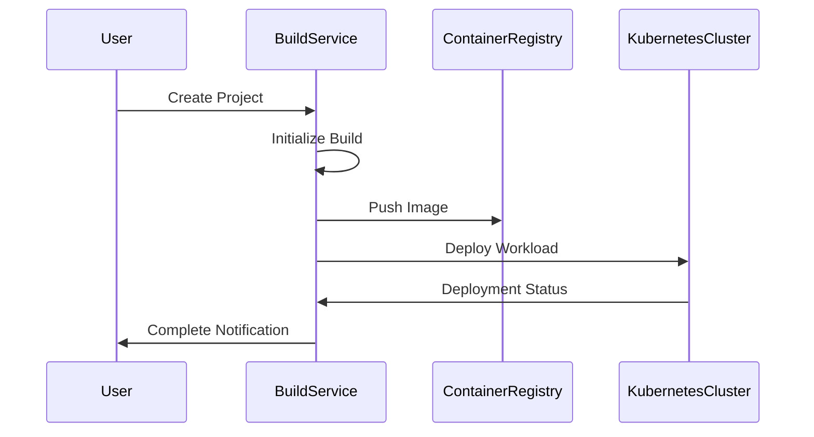

# Deploy Hub - Product Requirements Document

## 1. Product Overview
A self-hosted deployment and hosting platform for web applications, focusing on Next.js projects with Git integration.

## 2. Tech Stack
- Frontend: Next.js 14 (App Router)
- Backend: Next.js API Routes
- Database: Supabase (PostgreSQL)
- Authentication: Clerk
- Infrastructure: Docker, Kubernetes
- CI/CD: Custom implementation

## 3. Core Features

### 3.1 Authentication & User Management
- Sign in with Clerk (Email, GitHub, GitLab)
- Team management and collaboration
- Role-based access control (Admin, Developer, Viewer)
- Personal account settings and preferences

### 3.2 Git Integration

#### GitHub Integration
- OAuth authentication
- Repository access and selection
- Webhook management for auto-deployments
- Branch protection rules
- Pull request previews

#### GitLab Integration
- OAuth authentication
- Repository access and selection
- Webhook configuration
- CI/CD pipeline integration
- Branch protection rules

### 3.3 Deployment Features
- Automatic deployments on git push
- Manual deployments
- Environment variable management
- Deployment configurations
  - Node.js version selection
  - Build command customization
  - Output directory specification
  - Environment variable injection
- Preview deployments for pull requests
- Custom domain management
- SSL/TLS certificate automation
- Deployment protection rules

### 3.4 Project Management
- Project creation wizard
- Framework detection
- Build settings configuration
- Domain management
- Team access control
- Usage analytics
- Activity logs

### 3.5 Monitoring & Analytics
- Deployment status monitoring
- Build logs
- Runtime logs
- Performance metrics
  - Response times
  - Error rates
  - Resource usage
- Usage statistics
- Cost tracking

### 3.6 Infrastructure Management
- Docker container orchestration
- Kubernetes cluster management
- Auto-scaling configuration
- Load balancing
- Cache management
- CDN integration
- Database backups

## 4. Database Schema

### 4.1 Core Tables

```sql
-- Teams
teams (
id uuid primary key
name text
created_at timestamp
updated_at timestamp
)
-- Projects
projects (
id uuid primary key
team_id uuid references teams
name text
framework text
repository_url text
created_at timestamp
updated_at timestamp
)
-- Deployments
deployments (
id uuid primary key
project_id uuid references projects
status text
commit_hash text
branch text
created_at timestamp
updated_at timestamp
)
-- Domains
domains (
id uuid primary key
project_id uuid references projects
domain text
ssl_status text
verified boolean
created_at timestamp
updated_at timestamp
)
-- Environment Variables
env_variables (
id uuid primary key
project_id uuid references projects
key text
value text
environment text
created_at timestamp
)
```

## 5. API Endpoints

### 5.1 Authentication

```typescript
POST /api/auth/login
POST /api/auth/logout
POST /api/auth/refresh-token
```

### 5.2 Projects

```typescript
GET /api/projects
POST /api/projects
GET /api/projects/:id
PUT /api/projects/:id
DELETE /api/projects/:id
```

### 5.3 Deployments

```typescript
GET /api/deployments
POST /api/deployments
GET /api/deployments/:id
GET /api/deployments/:id/logs
POST /api/deployments/:id/cancel
```

### 5.4 Domains

```typescript
GET /api/domains
POST /api/domains
DELETE /api/domains/:id
POST /api/domains/:id/verify
```

## 6. Implementation Phases

### Phase 1: Foundation
- Basic authentication with Clerk
- GitHub integration
- Project creation and management
- Simple deployments

### Phase 2: Core Features
- GitLab integration
- Environment variable management
- Domain management
- Deployment logs

### Phase 3: Advanced Features
- Preview deployments
- Team collaboration
- Analytics and monitoring
- Custom domain SSL

### Phase 4: Infrastructure
- Kubernetes integration
- Auto-scaling
- CDN integration
- Performance optimization

## 7. Security Considerations
- Secure secret management
- RBAC implementation
- API rate limiting
- Audit logging
- Network isolation
- Regular security updates
- Vulnerability scanning

## 8. Performance Requirements
- Deployment initiation: < 5 seconds
- Build time: Based on project size
- Page load time: < 3 seconds
- API response time: < 200ms
- 99.9% uptime SLA
- Support for multiple concurrent deployments

## 9. Monitoring & Alerting
- System health monitoring
- Resource usage alerts
- Deployment failure notifications
- Security incident alerts
- Cost threshold alerts
- Performance degradation warnings

## 10. Documentation Requirements
- API documentation
- User guides
- Developer documentation
- Infrastructure setup guide
- Security best practices
- Troubleshooting guide

## 11. Project Creation & Infrastructure Setup

### 11.1 Overview
This document details the technical implementation of project creation and infrastructure setup process, outlining the complete flow from repository connection to live deployment.

### 11.2 System Components

#### 11.2.1 Core Services
```typescript
interface InfrastructureServices {
  GitService: {
    provider: 'github' | 'gitlab';
    setupWebhooks(): Promise<void>;
    analyzeRepository(): Promise<RepoAnalysis>;
  };
  
  ContainerService: {
    createSpecification(): Promise<ContainerSpec>;
    provisionResources(): Promise<void>;
  };
  
  KubernetesService: {
    createNamespace(): Promise<string>;
    deployWorkload(): Promise<void>;
    setupNetworking(): Promise<void>;
  };
  
  BuildService: {
    initiateBuild(): Promise<BuildProcess>;
    monitorProgress(): Promise<BuildStatus>;
  };
  
  DeploymentService: {
    createDeployment(): Promise<Deployment>;
    configureDomain(): Promise<Domain>;
    setupSSL(): Promise<void>;
  };
}
```

### 11.3 Workflow Sequence

#### 11.3.1 Repository Connection Phase
1. **Git Provider Authentication**
   - Validate OAuth tokens
   - Request repository access permissions
   - Store credentials securely

2. **Repository Analysis**
   - Scan repository contents
   - Detect framework and version
   - Identify build commands
   - Parse configuration files

#### 11.3.2 Infrastructure Provisioning Phase
1. **Container Configuration**
   ```yaml
   # container-spec.yaml
   version: '1.0'
   base:
     image: node:${detected-version}
     framework: ${detected-framework}
   
   build:
     commands:
       - npm install
       - ${detected-build-command}
     
   resources:
     limits:
       cpu: "1"
       memory: "2Gi"
     requests:
       cpu: "0.5"
       memory: "1Gi"
   ```

2. **Kubernetes Resources**
   ```yaml
   # kubernetes-deployment.yaml
   apiVersion: apps/v1
   kind: Deployment
   metadata:
     name: ${project-name}
     namespace: ${project-id}
   spec:
     replicas: 2
     selector:
       matchLabels:
         app: ${project-name}
     template:
       spec:
         containers:
           - name: ${project-name}
             image: ${container-image}
             env:
               - name: NODE_ENV
                 value: "production"
             resources:
               limits:
                 cpu: "1"
                 memory: "2Gi"
   ```

### 11.4 Build & Deployment Pipeline

#### 11.4.1 Build Process


#### 11.4.2 Deployment Configuration
```typescript
interface DeploymentConfig {
  projectId: string;
  environment: 'production' | 'preview';
  buildSettings: {
    command: string;
    outputDir: string;
    nodeVersion: string;
    framework: string;
  };
  resources: {
    cpu: string;
    memory: string;
    scaling: {
      min: number;
      max: number;
    };
  };
}
```

### 11.5 Monitoring & Scaling

#### 11.5.1 Metrics Collection
```typescript
interface ProjectMetrics {
  deployment: {
    buildTime: number;
    successRate: number;
    frequency: number;
  };
  performance: {
    responseTime: number;
    errorRate: number;
    uptimePercentage: number;
  };
  resources: {
    cpuUsage: number;
    memoryUsage: number;
    networkIO: number;
  };
}
```

#### 11.5.2 Auto-scaling Configuration
```yaml
# autoscaling-policy.yaml
apiVersion: autoscaling/v2
kind: HorizontalPodAutoscaler
metadata:
  name: ${project-name}-hpa
spec:
  scaleTargetRef:
    apiVersion: apps/v1
    kind: Deployment
    name: ${project-name}
  minReplicas: 2
  maxReplicas: 10
  metrics:
    - type: Resource
      resource:
        name: cpu
        target:
          type: Utilization
          averageUtilization: 70
```

### 11.6 Error Handling

#### 11.6.1 Recovery Procedures
```typescript
interface ErrorHandling {
  buildFailure: {
    maxRetries: 3;
    backoffPeriod: '30s';
    notificationTarget: 'developer';
  };
  deploymentFailure: {
    rollbackEnabled: true;
    healthCheckTimeout: '5m';
    notificationTarget: 'team';
  };
  infrastructureFailure: {
    failoverEnabled: true;
    regionFailover: true;
    notificationTarget: 'admin';
  };
}
```

### 11.7 Security Measures

#### 11.7.1 Project Isolation
- Namespace-level isolation
- Network policies
- Resource quotas
- Service account restrictions

#### 11.7.2 Secret Management
- Environment variable encryption
- Git provider token rotation
- SSL certificate management
- Access key segregation

### 11.8 Performance Requirements

#### 11.8.1 SLAs
- Project creation time: < 30 seconds
- Initial build time: < 5 minutes
- Deployment time: < 2 minutes
- Scale-up response: < 30 seconds
- Error recovery time: < 5 minutes

#### 11.8.2 Resource Allocation
- Default CPU: 0.5 core
- Default Memory: 1Gi
- Build container: 2Gi
- Maximum scale: 10 replicas

## 12. Framework Support & Build Configurations

### 12.1 Supported Frameworks

#### 12.1.1 PHP Frameworks
```typescript
interface PHPFrameworkConfig {
  laravel: {
    defaultVersion: '10.x',
    buildSteps: [
      'composer install --no-dev',
      'php artisan optimize',
      'php artisan config:cache',
      'php artisan route:cache'
    ],
    containerSpec: {
      baseImage: 'php:8.2-fpm-alpine',
      extensions: [
        'pdo_mysql',
        'redis',
        'gd',
        'zip'
      ],
      nginx: true
    }
  },
  symfony: {
    defaultVersion: '6.x',
    buildSteps: [
      'composer install --no-dev --optimize-autoloader',
      'php bin/console cache:clear --env=prod',
      'php bin/console assets:install'
    ],
    containerSpec: {
      baseImage: 'php:8.2-fpm-alpine',
      extensions: [
        'intl',
        'pdo_mysql',
        'redis'
      ],
      nginx: true
    }
  },
  wordpress: {
    defaultVersion: 'latest',
    buildSteps: [
      'composer install',
      'wp core install'
    ],
    containerSpec: {
      baseImage: 'wordpress:php8.2-fpm-alpine',
      extensions: [
        'imagick',
        'redis',
        'mysql'
      ],
      nginx: true,
      persistence: {
        uploads: true,
        plugins: true,
        themes: true
      }
    }
  }
}
```

#### 12.1.2 Frontend Frameworks
```typescript
interface FrontendFrameworkConfig {
  nextjs: {
    versions: ['13.x', '14.x'],
    buildSteps: [
      'npm install',
      'npm run build'
    ],
    outputDir: '.next',
    serverless: true
  },
  nuxt: {
    versions: ['2.x', '3.x'],
    buildSteps: [
      'npm install',
      'npm run build'
    ],
    outputDir: '.output',
    serverless: true
  },
  vue: {
    versions: ['2.x', '3.x'],
    buildSteps: [
      'npm install',
      'npm run build'
    ],
    outputDir: 'dist',
    static: true
  },
  svelte: {
    versions: ['latest'],
    buildSteps: [
      'npm install',
      'npm run build'
    ],
    outputDir: 'build',
    static: true
  },
  astro: {
    versions: ['latest'],
    buildSteps: [
      'npm install',
      'npm run build'
    ],
    outputDir: 'dist',
    static: true,
    serverless: {
      supported: true,
      config: 'astro.config.mjs'
    }
  }
}
```

### 12.2 Framework Detection & Build Configuration

```typescript
interface FrameworkDetection {
  patterns: {
    laravel: ['artisan', 'composer.json:laravel/framework'],
    symfony: ['symfony.lock', 'composer.json:symfony/framework-bundle'],
    wordpress: ['wp-config.php', 'composer.json:wordpress'],
    nextjs: ['next.config.js', 'package.json:next'],
    nuxt: ['nuxt.config.js', 'package.json:nuxt'],
    vue: ['vue.config.js', 'package.json:vue'],
    svelte: ['svelte.config.js', 'package.json:svelte'],
    astro: ['astro.config.mjs', 'package.json:astro']
  },
  
  buildConfig: {
    php: {
      containerStrategy: 'persistent',
      nginx: {
        enabled: true,
        config: './configs/nginx/${framework}.conf'
      },
      supervisor: {
        enabled: true,
        workers: {
          queue: 2,
          scheduler: 1
        }
      }
    },
    static: {
      containerStrategy: 'stateless',
      cdn: {
        enabled: true,
        caching: true
      }
    },
    serverless: {
      containerStrategy: 'function',
      scaling: {
        minInstances: 1,
        maxInstances: 10
      }
    }
  }
}
```

### 12.3 Framework-Specific Infrastructure

#### 12.3.1 PHP Applications
```yaml
# php-deployment.yaml
apiVersion: apps/v1
kind: Deployment
metadata:
  name: ${project-name}
spec:
  template:
    spec:
      containers:
        - name: php-fpm
          image: ${php-image}
          volumeMounts:
            - name: app-storage
              mountPath: /var/www/storage
        - name: nginx
          image: nginx:alpine
          volumeMounts:
            - name: nginx-config
              mountPath: /etc/nginx/conf.d/
      volumes:
        - name: app-storage
          persistentVolumeClaim:
            claimName: ${project-name}-storage
        - name: nginx-config
          configMap:
            name: ${project-name}-nginx-config
```

#### 12.3.2 Static Sites
```yaml
# static-deployment.yaml
apiVersion: apps/v1
kind: Deployment
metadata:
  name: ${project-name}
spec:
  template:
    spec:
      containers:
        - name: nginx
          image: nginx:alpine
          volumeMounts:
            - name: static-files
              mountPath: /usr/share/nginx/html
            - name: nginx-config
              mountPath: /etc/nginx/conf.d/
      volumes:
        - name: static-files
          emptyDir: {}
        - name: nginx-config
          configMap:
            name: ${project-name}-nginx-config
```

### 12.4 Database Support

```typescript
interface DatabaseSupport {
  mysql: {
    versions: ['5.7', '8.0'],
    persistent: true,
    backup: {
      enabled: true,
      schedule: '0 0 * * *'
    }
  },
  postgresql: {
    versions: ['13', '14', '15'],
    persistent: true,
    backup: {
      enabled: true,
      schedule: '0 0 * * *'
    }
  },
  redis: {
    versions: ['6', '7'],
    modes: ['cache', 'session'],
    persistent: false
  }
}
```

### 12.5 Cache & Queue Configuration

```typescript
interface CacheQueueConfig {
  cache: {
    redis: {
      enabled: true,
      size: '1Gi',
      maxmemory: '800mb',
      policy: 'allkeys-lru'
    }
  },
  queue: {
    redis: {
      enabled: true,
      size: '1Gi'
    },
    workers: {
      min: 1,
      max: 5,
      autoscaling: true
    }
  }
}
```

This technical design document provides a comprehensive blueprint for implementing the project creation and infrastructure setup functionality. It covers all major components, workflows, and considerations needed for a robust implementation.